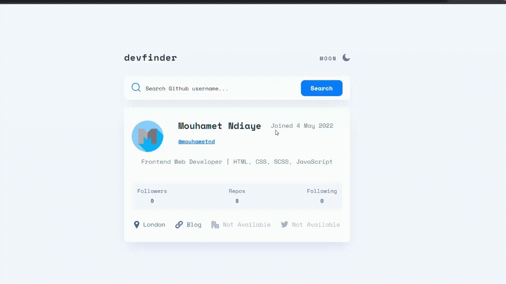

 # Welcome to the Github Dev Finder Web App! 🍃

This is a simple web app that allows you to search for a Github user and see their profile information.

This is a solution to the GitHub user search app challenge on Frontend Mentor with some additional features such as an `autocomplete` suggestion list and save preferences to `localStorage`. The app is built with `React.js`, `styled-components` and uses the `Github API`.    

## Links
- My Linkedin [Linkedin](https://www.linkedin.com/in/mouhametndiaye/)
- My email ahmetndiaye404@gmail.com
- Live Project [ Github Dev Finder Web App](https://mouhametnd-movies-app.netlify.app)

## Challenge  
##  Users should be able to:

- View the optimal layout for the app depending on their device's screen size
- See hover states for all interactive elements on the page
- Search for GitHub users by their username
- Get an autocomplete suggestion for the user's username
- See relevant user information based on their search
- Switch between light and dark themes
- Save preferences to local storage
- Have the correct color scheme chosen for them based on their computer preferences (prefers-color-scheme)

### Built with

- React - JS library
- Styled Components
- Fetch
- LocalStorage
- Some javascript new features
- Mobile-first workflow
- Flexbox
- CSS custom properties
- Semantic HTML5 markup

## Expected behavior

- On the first load, show the profile information for `mouhametnd` (me).
- Handle errors when fetching user information, fetching autocomplete suggestions, no query entered, etc.  
- If any of the location, website, Twitter, or company properties are empty, show the text "Not Available" with transparency added (as shown in the design).

## Preview of the App

